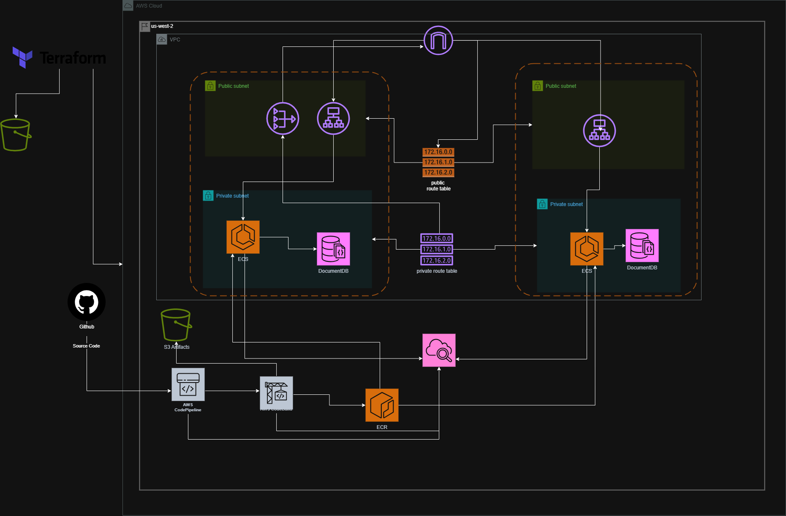

# Deploying a Three-Tier Application on AWS using CodePipeline and ECS (EC2)

## Overview

This project demonstrates the **end-to-end deployment of a production-grade three-tier web application** on AWS using **Infrastructure as Code (Terraform)** and a **fully automated CI/CD pipeline** built with **AWS CodePipeline**.

The solution follows modern DevOps best practices including containerization, automated builds, continuous delivery, secure networking, and scalable infrastructure.

---

## High-Level Architecture

The architecture follows a **three-tier design**:
- **Frontend Tier** – React application served via Nginx on ECS
- **Backend Tier** – Node.js REST API running on ECS
- **Database Tier** – Amazon DocumentDB (MongoDB-compatible)

### Architecture Diagram



---

## Technology Stack

| Layer | Technology |
|-----|-----------|
| Infrastructure | Terraform |
| Container Runtime | Amazon ECS (EC2 Launch Type) |
| CI/CD | AWS CodePipeline, AWS CodeBuild |
| Load Balancing | Application Load Balancer (ALB) |
| Container Registry | Amazon ECR |
| Frontend | React + Nginx |
| Backend | Node.js (Express) |
| Database | Amazon DocumentDB |
| Logging | Amazon CloudWatch |

---

## Repository Structure

```

.
├── backend/                # Node.js backend service
├── frontend/               # React frontend application
├── infra/terraform/        # Terraform IaC for AWS resources
├── buildspec.yml           # CodeBuild build specification
├── Task8.png               # Architecture diagram
├── Task8.pdf               # Project documentation (PDF)
└── README.md               # Project documentation

```

---

## Infrastructure Provisioning (Terraform)

All AWS resources are provisioned using Terraform.

### Key Components Created
- VPC with public and private subnets
- Application Load Balancer with listener rules
- ECS Cluster using EC2 capacity provider
- Auto Scaling Group with ECS-optimized AMI
- ECS Task Definitions and Services
- Amazon ECR repositories
- IAM roles and policies
- Amazon DocumentDB cluster
- CloudWatch log groups

Terraform ensures **repeatable, version-controlled infrastructure**.

---

## CI/CD Pipeline Design

The CI/CD pipeline is implemented using **AWS CodePipeline** and consists of three stages:

### 1. Source Stage
- Integrated with GitHub via CodeStar connection
- Automatically triggers on code changes

### 2. Build Stage
- Implemented using AWS CodeBuild
- Builds Docker images for frontend and backend
- Pushes images to Amazon ECR

### 3. Deploy Stage
- Updates ECS task definitions
- Triggers rolling deployments for ECS services
- Zero manual intervention required

---

## ECS Deployment Strategy

- ECS uses **EC2 launch type** for better control over instances
- Services are deployed in **private subnets**
- ALB routes traffic based on path rules:
  - `/api/*` → Backend service
  - `/` → Frontend service
- Health checks ensure only healthy tasks receive traffic

---

## Environment Configuration

### Backend
- Environment variables injected via ECS task definition
- MongoDB connection string configured using DocumentDB endpoint
- TLS enabled for secure database communication

### Frontend
- API base URL configured to route through ALB
- Production-ready Nginx configuration used

Local `.env` files are used **only for development**, not in production.

---

## Security Considerations

- No direct internet access to ECS tasks
- Security Groups restrict traffic strictly via ALB
- IAM roles follow least-privilege principle
- Database credentials injected securely at runtime

---

## Monitoring and Logging

- Application logs streamed to CloudWatch
- ECS task lifecycle events monitored
- ALB target health monitored continuously

---

## Validation and Testing

- Application accessible via ALB DNS
- Backend API reachable through `/api` paths
- Successful login and API interactions verified
- CI/CD pipeline validated with multiple deployments

---

## Problems Faced and Troubleshooting

Key challenges included:
- ECS tasks failing due to missing environment variables
- MongoDB connection issues with DocumentDB TLS requirements
- IAM permission issues in CodePipeline
- ALB 503 errors caused by unhealthy targets

Each issue was resolved through log analysis, configuration fixes, and Terraform updates.  
(See full **Problems Faced and Resolution** section in documentation.)

---

## Conclusion

This project demonstrates a **real-world DevOps deployment** using AWS native services and Terraform. It highlights:

- End-to-end automation
- Scalable and secure architecture
- Production-ready CI/CD pipeline
- Strong understanding of ECS, networking, and cloud infrastructure

The implementation closely aligns with **industry standards** and reflects hands-on experience with cloud-native system design and operations.

---

## Author

**Sardar Noor Ul Hassan**  
DevOps / Cloud Infrastructure Engineer  
AWS Certified Solutions Architect – Associate


